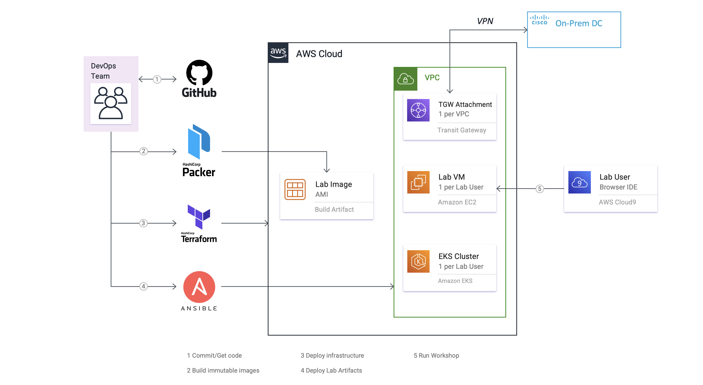
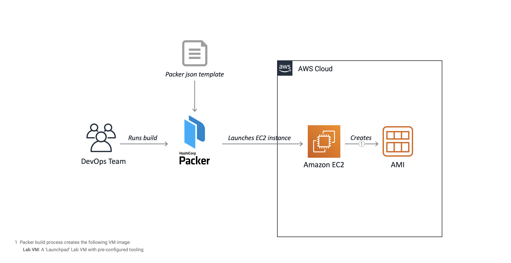
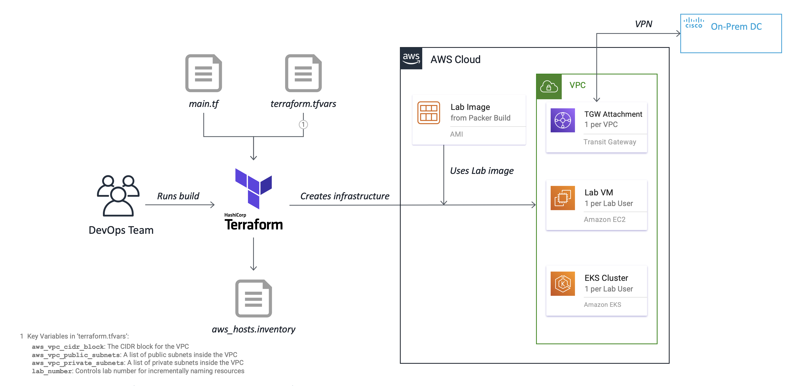

# AWS Amazon Linux 2 AMI Build and Deployment Instructions

## Overview

Here is an example of the deployment architecture when deployed to the AWS Cloud Platform:  

__FSO Lab DevOps: Workshop Deployment on AWS__


## Build and Deployment Steps

Before building and deploying the FSO Lab DevOps artifacts for AWS, you will need to install the AWS CLI v2 
command-line interface. The AWS CLI manages authentication, local configuration, developer workflow, and 
interactions with the AWS Cloud APIs. It is the primary tool used to create and manage AWS Cloud resources.  

The AWS CLI will also allow you to cleanup and delete any resources created by the DevOps tooling when 
you are finished, such as purging old AMI images created by Packer. Note that in AWS CLI version 2, the 
required Python 3 libraries are now embedded in the installer and no longer need to be installed separately.

## AWS-Specific Installation Instructions - macOS

Here is a list of the recommended open source software to be installed on the host macOS machine:

-	Amazon AWS CLI 2.15.12 (command-line interface)

Perform the following steps to install the needed software:

1.	Install [AWS CLI 2.15.12](https://docs.aws.amazon.com/cli/latest/userguide/install-cliv2-mac.html).  
    `brew install awscli@2`  

2.	Validate installed command-line tools:

    ```bash
    aws --version
    # aws-cli/2.15.12 Python/3.11.7 Darwin/23.2.0 source/arm64 prompt/off
    ```

## AWS-Specific Installation Instructions - Windows 64-Bit

As stated previously, Windows users have a wide variety of choice in terminals and shells for running 
the command-line tools, such as the Windows Command Prompt, 
[PowerShell](https://docs.microsoft.com/en-us/powershell/), 
[Windows Terminal](https://docs.microsoft.com/en-us/windows/terminal/get-started), 
[Git Bash](https://git-scm.com/download/win), and the 
[Windows Subsystem for Linux (WSL)](https://docs.microsoft.com/en-us/windows/wsl/about).  

Although you are free to use any of these tools, the installation steps described below will be based 
on the usage of the **Git Bash** terminal or the **Windows Subsystem for Linux (WSL)** with an Ubuntu 
installation.  

Here is a list of the recommended open source software to be installed on the host Windows machine:

-	Amazon AWS CLI 2.15.12 (command-line interface)

### Git Bash installation - Windows 64-Bit

Perform the following steps to install the needed software:

1.	Install [AWS CLI 2.15.12](https://awscli.amazonaws.com/AWSCLIV2.msi) for Windows 64-bit.  
    Run the downloaded MSI installer and follow the on-screen instructions.  

    **NOTE:** For Windows users, the MSI installation package offers a familiar and convenient way to 
    install the AWS CLI without installing any other prerequisites. However, when updates are released, 
    you must repeat the installation process to get the latest version of the AWS CLI. If you prefer 
    more frequent updates, consider using `pip` as described in the AWS CLI 
    [install guide](https://docs.aws.amazon.com/cli/latest/userguide/install-windows.html).

2.	Validate installed command-line tool:

    ```bash
    aws --version
    # aws-cli/2.15.12 Python/3.11.6 Windows/10 exe/AMD64 prompt/off
    ```

### Windows Subsystem for Linux (WSL) installation - Ubuntu 64-Bit

1.	Install [AWS CLI 2.15.12](https://docs.aws.amazon.com/cli/latest/userguide/getting-started-install.html) for Ubuntu 64-bit.  
    ```bash
    cd /tmp
    curl "https://awscli.amazonaws.com/awscli-exe-linux-x86_64.zip" -o "awscliv2.zip"
    unzip awscliv2.zip
    sudo ./aws/install
    rm -i awscliv2.zip
    ```


## Configuration and Validation

The configuration and validation steps are essentially identical for macOS and Windows 64-Bit systems. 
Perform the following steps to complete these tasks:  

1.	Configure AWS CLI and authenticate to the AWS Cloud:

    ```bash
    aws configure
    # AWS Access Key ID [None]: <Your_AWS_ACCESS_KEY_ID>
    # AWS Secret Access Key [None]: <Your_AWS_SECRET_ACCESS_KEY>
    # Default region name [None]: us-east-2
    # Default output format [None]: json
    ```

2.	Verify your AWS credentials:

    ```bash
    aws sts get-caller-identity
    # {
    #   "UserId": "<Your_User_ID>",
    #   "Account": "<Your_Account>",
    #   "Arn": "arn:aws:iam::<Your_Account>:<Your_Amazon_Resource_Name>"
    # }
    ```

## Prepare for the Build

All user credentials and installation inputs are driven by environment variables and can be configured 
within the `set_devops_env.sh` script you will create in `./bin`. There are LOTS of options, but most 
have acceptable defaults. You only need to concentrate on a handful that are uncommented in the template 
file.  

In particular, you will need to add the AWS Access Key ID and Secret Access Key used earlier as environent 
variables.

To prepare for the build, perform the following steps:

1.	Customize your FSO Lab DevOps project environment:

    Copy the template file and edit `set_devops_env.sh` located in `./bin` to customize the environment 
    variables for your environment.

    ```bash
    cd ~/cco-lab-devops/bin
    cp -p set_devops_env.sh.template set_devops_env.sh
    vi set_devops_env.sh
    ```

    The following environment variables are the most common to be overridden. They are grouped by sections 
    in the file, so you will have to search to locate the exact line. For example, the AWS-related variables 
    are at the end of the file.  

    The first two are mandatory and the others are optional, but helpful. If you are building the AMI images 
    in the `us-east-2` region (Ohio), the region-related variables can be left alone.

    ```bash
    AWS_ACCESS_KEY_ID="<Your_AWS_ACCESS_KEY_ID>"
    AWS_SECRET_ACCESS_KEY="<Your_AWS_SECRET_ACCESS_KEY>"

    aws_ami_owner="<Your Firstname> <Your Lastname>"
    ```

    Save and source the environment variables file in order to define the variables in your shell.

    ```bash
    source ./set_devops_env.sh
    ```

    Validate the newly-defined environment variables via the following commands:

    ```bash
    env | grep -i ^aws | sort
    ```

## Build the Amazon Machine Image (AMIs) with Packer

Follow these instructions to build the AWS Amazon Linux 2 (AL2) AMI image:

-	__LPAD VM__: An AWS EC2 'Launchpad' Lab VM with pre-configured tooling for Kubernetes and AWS CLI Operations.

Here is an example of the Packer build flow for the AWS Cloud:

__Packer Build Flow for AWS__


1.	Build the __LPAD VM__ Amazon Linux 2 AMI image:

    This will take several minutes to run.

    ```bash
    $ cd ~/cco-lab-devops/builders/packer/aws
    packer build fso-lpad-al2.json
    ```

    If the build fails, check to ensure the accuracy of all variables edited above.

2.	[Optional] Delete older __LPAD VM__ AMI images:

    Run this utility script to automatically remove previously created AMI images. By default, the latest 
    AMI image is not removed. To delete ALL images, set the `aws_ami_keep_last` environment variable to `false`.

    ```bash
    cd ~/cco-lab-devops/provisioners/scripts/utils
    ./delete_aws_ami_images_by_region.sh
    ```

The steps for creating the AMI's are completed.

## Deploy the Infrastructure with Terraform

Follow these instructions to deploy the infrastructure and create a Lab environment for the lab participant:

-	__LPAD VM__: Deploy the AWS EC2 'Launchpad' Lab VM.

Here is an example of the Terraform build flow for the AWS Cloud:

__Terraform Build Flow for AWS__


__NOTE:__ The following steps are repeated for each major element of the workshop.

1.	Deploy the AWS Lab infrastructure.

	a.	Create the Terraform `terraform.tfvars` file. Cisco SEs can download an example (`.tfvars`) file
    [here](https://drive.google.com/file/d/1uhgAEXtGSB5JKfBEvDp_iq8yIyoEYMOE/view?usp=sharing).

    __NOTE:__ The `terraform.tfvars` file is automatically loaded by Terraform and provides a convenient way to
    override input parameters found in [`variables.tf`](builders/terraform/azure/aks-monitoring-lab/lpad/variables.tf). The two
    most important variables are:

    | Variable                        | Description                                                                                                                                                                                                                                                                                               |
    |---------------------------------|------------------------------------------------------------|
    | `lab_count`                     | Number of Lab environments to launch.
    | `lab_start_number`              | Starting lab number for incrementally naming Lab resources.

    <br>

    ```bash
    $ cd ~/projects/AppD-Cloud-Kickstart/builders/terraform/azure/aks-monitoring-lab/lpad
    $ vi terraform.tfvars
    ...
    # set number of lab environments to launch with starting lab number.
    lab_count = 10
    lab_start_number = 1
    ...
    ```

	b.	Deploy the Lab infrastructure on Azure. Execute the following Terraform lifecycle commands in sequence:

    ```bash
    $ cd ~/projects/AppD-Cloud-Kickstart/builders/terraform/azure/aks-monitoring-lab/lpad
    $ terraform --version
    $ terraform init
    $ terraform validate
    $ terraform plan -out terraform-lpad.tfplan
    $ terraform apply terraform-lpad.tfplan
    ```

## AWS Amazon Linux 2 Bill-of-Materials

__LPAD VM__ - The following AWS CLI command-line tools and utilities are pre-installed:

-	Amazon AWS CLI 2.15.12 (command-line interface)
-	Amazon AWS Cloud9 IDE
-	Amazon AWS EC2 Instance Metadata Query Tool (command-line interface)
-	Amazon AWS EKS CLI [eksctl] 0.168.0 (command-line interface)
-	Amazon AWS Kubernetes Control CLI [kubectl] 1.28.5 (command-line interface)
-	Ansible 2.9.23
-	Ant 1.10.14
-	AppDynamics Node.js Serverless Tracer 21.11.348
-	Docker 20.10.23 CE
	-	Docker Bash Completion
	-	Docker Compose 2.24.2
-	Git 2.43.0
	-	Git Bash Completion
	-	Git-Flow 1.12.3 (AVH Edition)
	-	Git-Flow Bash Completion
-	Go 1.21.6
-	Gradle 8.5
-	Helm CLI 3.14.0 (Package Manager for Kubernetes)
-	Java SE JDK 8 Update 402 (Amazon Corretto 8)
-	Java SE JDK 11.0.22 (Amazon Corretto 11)
-	Java SE JDK 17.0.10 (Amazon Corretto 17)
-	Java SE JDK 21.0.2 (Amazon Corretto 21)
-	JMESPath jp 0.2.1 (command-line JSON processor)
-	jq 1.7.1 (command-line JSON processor)
-	Maven 3.9.6
-	Node.js JavaScript runtime v16.20.2
-	npm JavaScript Package Manager for Node.js 9.9.2
-	nvm (Node Version Manager) bash script 0.39.7
-	Packer 1.10.0
-	Python 2.7.18
	-	Pip 23.3.2
-	Python 3.7.10
	-	Pip3 23.3.2
-	Serverless Framework CLI 3.38.0
-	Terraform 1.7.0
-	VIM - Vi IMproved 9.0
-	XMLStarlet 1.6.1 (command-line XML processor)
-	yq 4.40.5 (command-line YAML processor)
