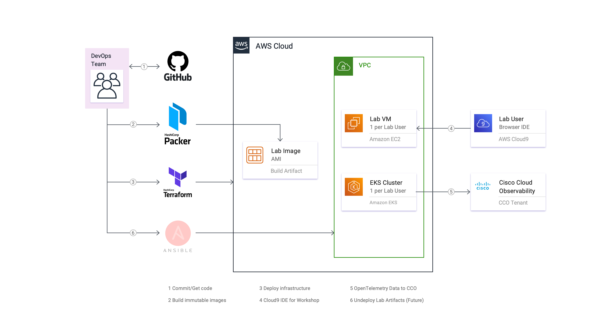

# Build Steps for Preparing the Workshop
## Overview

The provisioning, configuration, and preparation needed for delivering the Cisco Cloud Observability 
(CCO) workshop can be an extremely tedious and time-consuming challenge for SE's. To solve that problem, 
the Channel CCO Workshop project delivers a set of artifacts to automate the build, deployment, and 
configuration portion of these pre-workshop activities using open source tooling.  

Here is a diagram of the deployment architecture when deployed to the AWS Cloud Platform:  

__Cisco Cloud Observability Workshop: Deployment on AWS__


## Build and Deployment Tools

In order to build and deploy the Channel CCO Workshop resources, you will first need to install the 
following set of command-line utilities on either your local machine or a suitable VM:

### Git

[Git](https://git-scm.com/) is a fast, scalable, distributed revision control system with an unusually 
rich command set that provides both high-level operations and full access to internals.  

For more details, please visit the Git project home [here](https://github.com/git/git).

### AWS Command Line Interface (v2)

The [AWS Command Line Interface](https://docs.aws.amazon.com/cli/latest/userguide/cli-chap-welcome.html) 
(AWS CLI) is an open source tool that enables you to interact with AWS services using commands in your 
command-line shell. With minimal configuration, the AWS CLI enables you to start running commands that 
implement functionality equivalent to that provided by the browser-based AWS Management Console from the 
command prompt in your terminal program.  

The AWS CLI manages authentication, local configuration, developer workflow, and interactions with the 
AWS Cloud APIs. It is the primary tool used to create and manage AWS Cloud resources. It will also allow 
you to cleanup and delete any resources created by the DevOps tooling when you are finished, such as 
purging old AMI images created by Packer.  

The AWS CLI version 2 is the most recent major version of the AWS CLI and supports all of the latest 
features. Please see the 
[AWS CLI installation guide](https://docs.aws.amazon.com/cli/latest/userguide/getting-started-install.html) 
to get started.

### Packer

[Packer](https://packer.io/) is an open source tool for creating identical machine images for multiple 
platforms from a single source configuration. Packer is lightweight, runs on every major operating system, 
and is highly performant. A machine image (or immutable VM image) is a single static unit that contains 
a pre-configured operating system and installed software which is used to quickly create new running 
machines.  

As part of this project, Packer is used to create an immutable Lab VM image consisting of a standardized 
installation of Amazon Linux 2023 (the default) with a set of common software. This static machine image is 
later used by Terraform when standing-up the infrastructure and compute resources needed by workshop 
participants. Currently, this VM consists of the following type:

-	__CCO Lab VM__: A 'Launchpad' Lab VM with pre-configured tooling for Kubernetes and AWS CLI operations.

For SE-lead workshops, the Lab VM image is built and maintained by Cisco AppDynamics. However, all of the 
artifacts used to build the image are present in this project, so customers are free to customize and 
build their own VM images if desired. Additional support for Amazon Linux 2, CentOS 7.9, Ubuntu 20.04, and 
Ubuntu 22.04 is also available.

### Terraform

[Terraform](https://terraform.io/) is a tool for building, changing, and versioning infrastructure 
safely and efficiently. Terraform can manage existing and popular service providers as well as custom 
in-house solutions. The infrastructure Terraform can manage includes low-level components such as compute 
instances, storage, and networking, as well as high-level components such as DNS entries, SaaS features, 
etc.  

In this project, Terraform is used to automate the deployment of the Lab infrastructure, including VPCs, 
subnets, security groups, load balancers, Kubdernetes clusters, and Lab VM using templates.

Installation guides for your platform can be found 
[here](https://developer.hashicorp.com/terraform/downloads).

### jq

[jq](https://jqlang.github.io/jq/) is a lightweight and flexible command-line JSON processor akin to `sed`, 
`awk`, and `grep` for JSON data. It's written in portable C and has zero runtime dependencies, allowing you 
to easily slice, filter, map, and transform structured data.

The [jq binaries](https://github.com/jqlang/jq/releases/latest/) can be downloaded from GitHub.

## Get Started

To configure the CCO Lab workshop environments, the first step is to set-up your development environment 
by installing the needed software.

### Prerequisites

You install this set of command-line utilities on a control node, usually your local laptop, which then 
uses the cloud CLI and/or SSH to communicate with your cloud resources and managed nodes.

__NOTE:__ A remote Virtual Machine with access to the internet can also be used as the control node. The 
specific instructions for installing the required software are left as an exercise for the reader.

## Installation Instructions - macOS

For macOS environments, the following open source software needs to be installed on the host macOS machine:

-	Homebrew 4.2.9
-	Git 2.43.2
-	Amazon AWS CLI 2.15.22 (command-line interface)
-	Packer 1.10.1
-	Terraform 1.7.4
-	jq 1.7.1

Perform the following steps to install the needed software:

1.	Install the [Homebrew 4.2.9](https://brew.sh/) package manager for macOS 64-bit. Paste the following into a macOS Terminal prompt:  
    ```bash
    /bin/bash -c "$(curl -fsSL https://raw.githubusercontent.com/Homebrew/install/master/install.sh)"
    ```

2.	Install [Git 2.43.2](https://git-scm.com/downloads) for macOS 64-bit.  
    ```bash
    brew install git
    ```

3.	Install [AWS CLI 2.15.22](https://docs.aws.amazon.com/cli/latest/userguide/install-cliv2-mac.html).  
    ```bash
    brew install awscli@2
    ```

4.	Install [Packer 1.10.1](https://www.packer.io/downloads.html) for macOS 64-bit.  
    ```bash
    brew tap hashicorp/tap
    brew install hashicorp/tap/packer
    ```

5.	Install [Terraform 1.7.4](https://www.terraform.io/downloads.html) for macOS 64-bit.  
    ```bash
    brew tap hashicorp/tap
    brew install hashicorp/tap/terraform
    ```

6.	Install [jq 1.7.1](https://jqlang.github.io/jq/) for macOS 64-bit.  
    ```bash
    brew install jq
    ```

### Configuration and Validation - macOS

1.	Validate installed command-line tools:

    ```bash
    brew --version
    # Homebrew 4.2.9

    brew doctor
    # Your system is ready to brew.

    git --version
    # git version 2.43.2

    aws --version
    # aws-cli/2.15.22 Python/3.11.7 Darwin/23.3.0 source/arm64 prompt/off

    packer --version
    # 1.10.1

    terraform --version
    # Terraform v1.7.4

    jq --version
    # jq-1.7.1
    ```

2.	Configure Git for local user:

    ```bash
    git config --global user.name "<first_name> <last_name>"
    git config --global user.email "<your_email>"
    git config --global --list
    ```

## Installation Instructions - Windows 64-Bit

Windows users have a wide variety of choice in terminals and shells for running the command-line tools, 
such as the Windows Command Prompt, [PowerShell](https://docs.microsoft.com/en-us/powershell/), 
[Windows Terminal](https://docs.microsoft.com/en-us/windows/terminal/get-started), 
[Git Bash](https://git-scm.com/download/win), and the 
[Windows Subsystem for Linux (WSL)](https://docs.microsoft.com/en-us/windows/wsl/about).  

Although you are free to use any of these tools, the installation steps described below will be based 
on the usage of the **Git Bash** terminal or the **Windows Subsystem for Linux (WSL)** with an Ubuntu 
installation.  

Here is a list of the recommended open source software to be installed on the host Windows machine:

-	Curl 7.68.0 (Ubuntu 64-bit only)
-	Wget 1.21.1 (Ubuntu 64-bit only)
-	Git 2.43.0
-	Packer 1.10.1
-	Terraform 1.7.4
-	jq 1.7.1

### Git Bash installation - Windows 64-Bit

Perform the following steps to install the needed software:

1.	Install [Git 2.43.0](https://github.com/git-for-windows/git/releases/download/v2.43.0.windows.1/Git-2.43.0-64-bit.exe) for Windows 64-bit.

2.	Install [AWS CLI 2.15.22](https://awscli.amazonaws.com/AWSCLIV2.msi) for Windows 64-bit.  
    Run the downloaded MSI installer and follow the on-screen instructions.  

    **NOTE:** For Windows users, the MSI installation package offers a familiar and convenient way to 
    install the AWS CLI without installing any other prerequisites. However, when updates are released, 
    you must repeat the installation process to get the latest version of the AWS CLI. To see when the 
    latest version was released, see the 
    [AWS CLI version 2 Changelog](https://raw.githubusercontent.com/aws/aws-cli/v2/CHANGELOG.rst) on GitHub.

3.	Install [Packer 1.10.1](https://releases.hashicorp.com/packer/1.10.1/packer_1.10.1_windows_amd64.zip) for Windows 64-bit.  
    Create suggested install folder and extract contents of ZIP file to:  
    `C:\HashiCorp\bin`  

4.	Install [Terraform 1.7.4](https://releases.hashicorp.com/terraform/1.7.4/terraform_1.7.4_windows_amd64.zip) for Windows 64-bit.  
    Create suggested install folder and extract contents of ZIP file to:  
    `C:\HashiCorp\bin`  

5.	Install [jq 1.7.1](https://github.com/jqlang/jq/releases/download/jq-1.7.1/jq-win64.exe) for Windows 64-bit.  
    Create suggested install folder and rename binary to:  
    `C:\Program Files\Git\usr\local\bin\jq.exe`

### Configuration and Validation - Windows 64-Bit

1.	Set Windows Environment `PATH` to:

    ```bash
    PATH=C:\HashiCorp\bin;C:\Program Files\Git\usr\local\bin;%PATH%
    ```

2.	Reboot Windows.

3.	Launch Git Bash.  
    Start Menu -- > All apps -- > Git -- > Git Bash

4.	Validate installed command-line tools:

    ```bash
    git --version
    # git version 2.43.0.windows.1

    aws --version
    # aws-cli/2.15.22 Python/3.11.6 Windows/10 exe/AMD64 prompt/off

    packer --version
    # 1.10.1

    terraform --version
    # Terraform v1.7.4

    jq --version
    # jq-1.7.1
    ```

5.	Configure Git for local user:

    ```bash
    git config --global user.name "<first_name> <last_name>"
    git config --global user.email "<your_email>"
    git config --global --list
    ```

### Windows Subsystem for Linux (WSL) installation - Ubuntu 64-Bit

1.	Install [Curl 7.68.0](http://manpages.ubuntu.com/manpages/trusty/man1/curl.1.html) for Ubuntu 64-bit.  
    ```bash
    sudo apt install curl
    ```

2.	Install [Wget 1.21.1](https://www.gnu.org/software/wget/manual/wget.html) for Ubuntu 64-bit.  
    ```bash
    sudo apt install wget
    ```

3.	Install [Git 2.43.2](https://git-scm.com/downloads) for Ubuntu 64-bit.  
    ```bash
    sudo apt install git
    ```

    ```bash
    # download aws cli 2 binary.
    sudo mkdir -p /usr/local/src/aws-cli
    sudo cd /usr/local/src/aws-cli
    sudo curl -s -L "https://d1vvhvl2y92vvt.cloudfront.net/awscli-exe-linux-x86_64.zip" -o "awscli-exe-linux-x86_64.zip"

    # uninstall existing aws cli 2 installation.
    sudo rm -f /usr/local/bin/aws
    sudo rm -f /usr/local/bin/aws_completer
    sudo rm -Rf /usr/local/aws-cli

    # install aws cli 2.
    sudo unzip awscli-exe-linux-x86_64.zip
    sudo chown -R root:root .
    sudo ./${aws_cli_folder}/install --install-dir ${aws_cli_install_dir} --bin-dir ${aws_cli_bin_dir}
#./${aws_cli_folder}/install --install-dir ${aws_cli_install_dir} --bin-dir ${aws_cli_bin_dir} --update

# cleanup installer files.
rm -f ${aws_cli_binary}
rm -f ${aws_cli_sig_file}
rm -Rf ${aws_cli_folder}

# set aws cli 2 installation variables. ------------------------------------------------------------
aws_cli_install_dir="/usr/local/aws-cli"
aws_cli_bin_dir="/usr/local/bin"
aws_cli_binary="awscli-exe-linux-x86_64.zip"
aws_cli_folder="aws"
aws_cli_pgpkey_file="aws-cli-2-public-key.asc"
aws_cli_sig_file="${aws_cli_binary}.sig"
    ```


4.	Install [Packer 1.10.1](https://www.packer.io/downloads.html) for Ubuntu 64-bit.  
    ```bash
    cd /usr/local/bin
    sudo wget https://releases.hashicorp.com/packer/1.10.1/packer_1.10.1_linux_amd64.zip
    sudo unzip packer_1.10.1_linux_amd64.zip
    sudo rm -i packer_1.10.1_linux_amd64.zip
    ```

5.	Install [Terraform 1.7.4](https://www.terraform.io/downloads.html) for Ubuntu 64-bit.  
    ```bash
    cd /usr/local/bin
    sudo wget https://releases.hashicorp.com/terraform/1.7.4/terraform_1.7.4_linux_amd64.zip
    sudo unzip terraform_1.7.4_linux_amd64.zip
    sudo rm -i terraform_1.7.4_linux_amd64.zip
    ```

6.	Install [jq 1.7.1](https://jqlang.github.io/jq/) for macOS 64-bit.  
    ```bash
    sudo apt install jq
    ```

### Configuration and Validation - Ubuntu 64-Bit

1.	Validate installed command-line tools:

    ```bash
    git --version
    # git version 2.43.2

    packer --version
    # 1.10.1

    terraform --version
    # Terraform v1.7.4

    jq --version
    # jq-1.7.1
    ```

2.	Configure Git for local user:

    ```bash
    git config --global user.name "<first_name> <last_name>"
    git config --global user.email "<your_email>"
    git config --global --list
    ```

## Get the Code

1.	Create a folder for your FSO Lab DevOps project or use your home directory:

    ```bash
    cd ~
    ```

2.	Get the code from GitHub:

    ```bash
    git clone https://github.com/APO-SRE/fso-lab-devops.git
    cd fso-lab-devops
    ```

## Build the VM Image and Deploy the Lab Infrastructure

The FSO Lab DevOps project currently supports a VM image build for Amazon AWS. Click on the link below 
for platform-specific instructions and a Bill-of-Materials:

-	[AWS Build and Deploy](AWS_VM_BUILD_INSTRUCTIONS.md): Instructions
